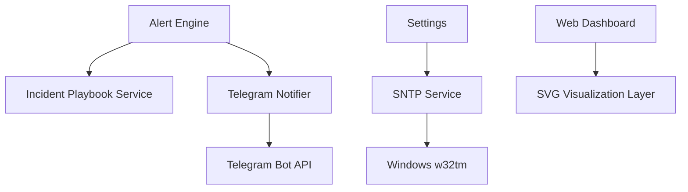
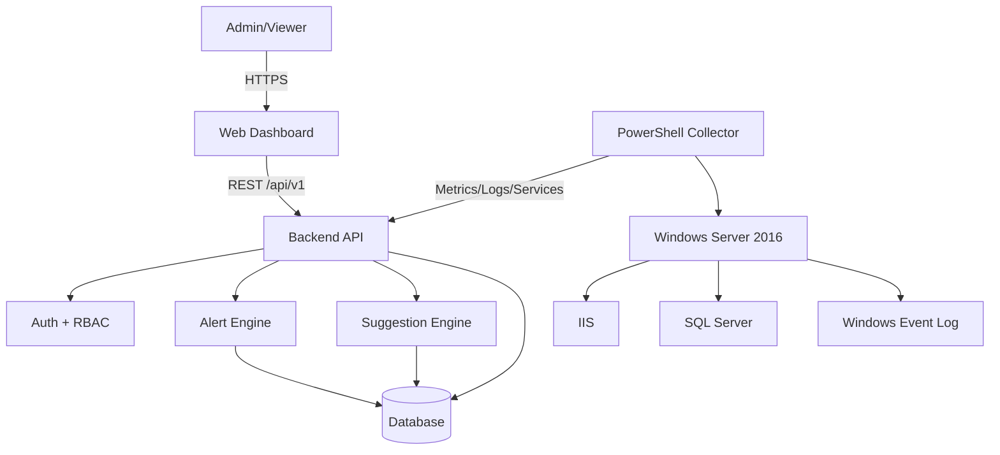
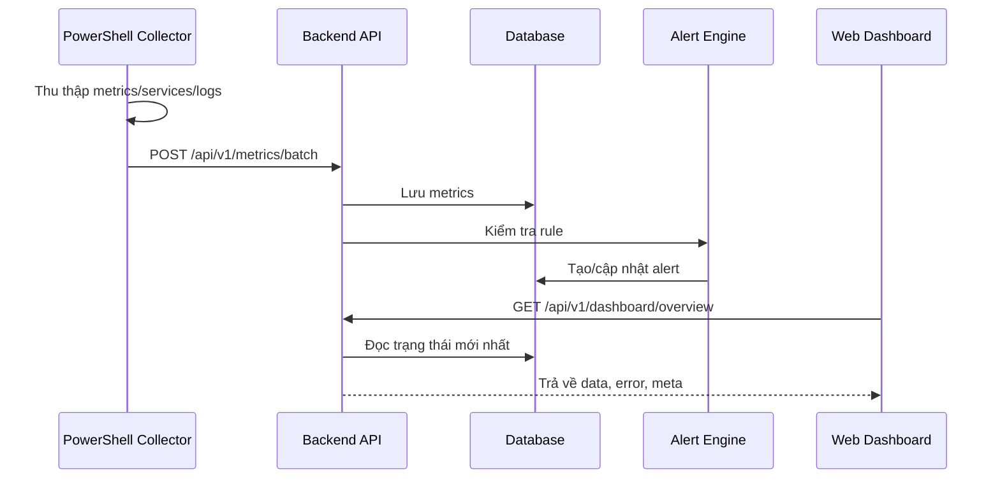

# Kiến trúc hệ thống

## [MODIFY] NOC module boundaries

Refactor hướng NOC tách rõ 4 nhóm:

- Monitoring: overview, metrics, services, server state.
- Incident management: alerts, incidents, incident playbook, acknowledge/resolve lifecycle.
- Security: auth log, failed login, firewall/HTTPS posture.
- Configuration/Lab: settings và mô phỏng sự cố phục vụ demo.

Settings và Lab không nằm trong luồng giám sát chính; chúng là công cụ cấu hình và trình diễn.

## [NEW] Advanced modules

Các module mở rộng từ development plan:

- SNTP Service: kiểm tra độ lệch thời gian với NTP server và hỗ trợ đồng bộ giờ Windows Server bằng `w32tm`.
- Telegram Notifier: gửi cảnh báo warning/critical tới Telegram khi alert mới được tạo.
- Incident Playbook Service: chuẩn hóa gợi ý xử lý theo 4 nhóm root causes, symptoms, immediate actions, preventions.
- Visualization Layer: render các biểu đồ SVG nhẹ cho CPU/RAM, disk, network và uptime map.

Ràng buộc:

- SNTP sync có thể gọi lệnh hệ thống nên chỉ admin được kích hoạt.
- Telegram token phải lưu trong settings hoặc secret store, không log ra response.
- Playbook không tự động chạy lệnh sửa lỗi; chỉ đưa đề xuất.

## Kiến trúc tổng thể

Hệ thống gồm các phần chính:

- Web Dashboard: giao diện quản trị và giám sát.
- Backend API: cung cấp REST API, xác thực, phân quyền, alert engine.
- Monitoring Collector: script PowerShell lấy metrics, service status và log từ Windows Server 2016.
- Database: lưu users, servers, metrics, services, alerts, logs, incidents và settings.
- Suggestion Engine: sinh gợi ý xử lý sự cố từ rule hoặc AI API.

## Module chính

### Web Dashboard

Trách nhiệm:

- Hiển thị overview server.
- Hiển thị biểu đồ metrics.
- Hiển thị trạng thái dịch vụ.
- Hiển thị alert và log.
- Cho phép admin cấu hình rule cơ bản.
- Hiển thị suggestion panel.

### Backend API

Trách nhiệm:

- Xác thực đăng nhập.
- Phân quyền Admin/Viewer.
- Nhận dữ liệu từ collector.
- Cung cấp dữ liệu cho dashboard.
- Chạy alert rule.
- Ghi audit log.

### Monitoring Collector

Trách nhiệm:

- Lấy CPU, RAM, disk, network, uptime.
- Kiểm tra trạng thái IIS và SQL Server.
- Đọc Windows Event Log cần thiết.
- Gửi dữ liệu về backend theo chu kỳ.

Collector nên chạy trên chính Windows Server 2016 trong môi trường lab.

### Alert Engine

Trách nhiệm:

- So sánh metrics với threshold.
- Kiểm tra service status.
- Tạo alert khi phát hiện bất thường.
- Tránh tạo alert trùng cho cùng sự cố đang mở.
- Cập nhật trạng thái resolved khi hệ thống trở lại bình thường.

### Suggestion Engine

Trách nhiệm:

- Nhận alert type và dữ liệu liên quan.
- Trả về nguyên nhân có thể.
- Trả về bước xử lý.
- Trả về biện pháp phòng tránh.

Phiên bản đầu nên dùng rule-based suggestion. AI API có thể thêm sau.

## Data flow

## Deployment flow trên Windows Server 2016

Luồng triển khai đề xuất:

1. Cài Windows Server 2016.
2. Cài IIS và các dịch vụ cần demo như SQL Server.
3. Cài Node.js runtime.
4. Cài database SQL Server hoặc MySQL.
5. Cấu hình backend API.
6. Cấu hình PowerShell collector chạy định kỳ bằng Task Scheduler hoặc Windows Service đơn giản.
7. Cấu hình IIS reverse proxy tới backend hoặc host dashboard tĩnh qua IIS.
8. Cấu hình HTTPS.
9. Cấu hình firewall chỉ mở port cần thiết.
10. Kiểm tra health check và demo scenarios.

```mermaid
flowchart LR
    InstallOS["Windows Server 2016"] --> InstallRuntime["Node.js + Database"]
    InstallRuntime --> DeployAPI["Deploy Backend API"]
    DeployAPI --> DeployUI["Deploy Web Dashboard"]
    DeployUI --> ConfigureCollector["Configure PowerShell Collector"]
    ConfigureCollector --> IISProxy["IIS Reverse Proxy/Hosting"]
    IISProxy --> Firewall["Firewall + HTTPS"]
    Firewall --> Verify["Health Check + Demo Test"]
```

