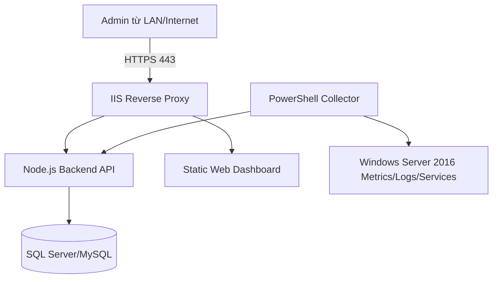

# Deployment

## [NEW] SNTP and Telegram deployment notes

SNTP:

- Server cần cho phép outbound UDP 123 nếu dùng NTP server bên ngoài.
- Trên Windows Server 2016, lệnh đồng bộ giờ có thể dùng:

```powershell
w32tm /config /manualpeerlist:"pool.ntp.org" /syncfromflags:manual /update
w32tm /resync
```

- Backend chỉ nên chạy lệnh này trong thao tác admin có audit log.

Telegram:

- Server cần outbound HTTPS tới `https://api.telegram.org`.
- Bot Token và Chat ID cấu hình qua settings hoặc biến môi trường, không commit vào repository.
- Khi demo trong mạng bị chặn internet, cần có fallback: dashboard vẫn hiển thị alert local, chỉ Telegram test thất bại.

Checklist:

- [ ] Outbound UDP 123 hoạt động nếu dùng SNTP.
- [ ] Outbound HTTPS tới Telegram hoạt động nếu bật Telegram alerts.
- [ ] Secret không nằm trong source code.
- [ ] Có kiểm tra fallback khi Telegram không gửi được.

## Mục tiêu triển khai

Triển khai hệ thống trong môi trường lab trên Windows Server 2016, ưu tiên đơn giản, dễ kiểm tra và dễ demo.

Kiến trúc triển khai đề xuất:



## Cài Node.js/runtime

Checklist:

- [ ] Cài Node.js LTS tương thích Windows Server 2016.
- [ ] Kiểm tra `node -v`.
- [ ] Kiểm tra `npm -v`.
- [ ] Cài dependencies backend.
- [ ] Build frontend nếu dùng React/Next hoặc chuẩn bị static files nếu dùng HTML/Bootstrap.

Ghi chú:

- Nếu dùng framework cần build, nên build trước khi demo.
- Không chạy development mode khi public demo.

## Cài database

Lựa chọn:

- SQL Server: hợp với Windows Server và môn Quản trị mạng.
- MySQL: dễ dùng nếu nhóm quen.

Checklist:

- [ ] Cài database engine.
- [ ] Tạo database riêng cho dashboard.
- [ ] Tạo user database với quyền vừa đủ.
- [ ] Chạy migration.
- [ ] Seed tài khoản admin ban đầu.
- [ ] Kiểm tra connection từ backend.

Khuyến nghị:

- Database không public ra internet.
- Chỉ backend được kết nối database.

## Cấu hình IIS reverse proxy hoặc hosting

Phương án 1: IIS reverse proxy tới Node.js backend.

Checklist:

- [ ] Cài IIS.
- [ ] Cài URL Rewrite nếu dùng reverse proxy.
- [ ] Cấu hình Application Request Routing nếu cần.
- [ ] Proxy `/api` tới backend local.
- [ ] Host static dashboard qua IIS hoặc proxy tới frontend.
- [ ] Tắt directory browsing.

Phương án 2: chạy Node.js trực tiếp trong lab.

Checklist:

- [ ] Backend listen trên port nội bộ, ví dụ 3000.
- [ ] Firewall chỉ mở port cần thiết.
- [ ] Dùng IIS hoặc reverse proxy nếu public.

## Env variables

Biến môi trường đề xuất:

```text
NODE_ENV=production
PORT=3000
DATABASE_URL=...
SESSION_SECRET=...
COLLECTOR_API_KEY=...
AI_API_KEY=...
PUBLIC_BASE_URL=https://example.local
```

Checklist:

- [ ] Không commit file `.env` chứa secret.
- [ ] Có file `.env.example`.
- [ ] Secret đủ dài và không dùng giá trị mặc định.
- [ ] AI key chỉ cấu hình nếu dùng AI API.

## Firewall port

Port đề xuất:

| Port | Mục đích | Public? |
|---:|---|---|
| 80 | HTTP redirect sang HTTPS | Có thể |
| 443 | HTTPS dashboard | Có |
| 3000 | Backend internal | Không nên |
| 1433 | SQL Server | Không public |
| 3306 | MySQL | Không public |
| 3389 | RDP | Hạn chế, tốt nhất qua VPN/IP allowlist |

Checklist:

- [ ] Chỉ mở 443 nếu demo public.
- [ ] Backend/database không public trực tiếp.
- [ ] RDP không mở rộng rãi ra internet.
- [ ] Kiểm tra bằng `Test-NetConnection`.

## Backup

Checklist:

- [ ] Backup database trước demo.
- [ ] Backup file cấu hình.
- [ ] Backup script collector.
- [ ] Backup screenshot demo.
- [ ] Kiểm tra restore database tối thiểu một lần trong lab.

Lịch backup gợi ý:

- Trước mỗi buổi demo hoặc báo cáo.
- Sau khi thay đổi schema.
- Sau khi thêm dữ liệu demo quan trọng.

## Health check

Endpoint gợi ý:

```text
GET /api/v1/dashboard/health
```

Nội dung kiểm tra:

- Backend running.
- Database connected.
- Last collector heartbeat.
- Open alerts count.

Checklist:

- [ ] Health endpoint không lộ secret.
- [ ] Dashboard hiển thị thời điểm cập nhật cuối.
- [ ] Có cảnh báo nếu collector mất heartbeat.

## Rollback strategy

Mục tiêu: nếu bản mới lỗi trước demo, có thể quay lại nhanh.

Checklist:

- [ ] Giữ bản build frontend trước đó.
- [ ] Giữ backup database trước migration.
- [ ] Mỗi migration có kế hoạch rollback hoặc backup.
- [ ] Ghi lại version đang chạy.
- [ ] Có script hoặc hướng dẫn restart backend.

Quy trình rollback đơn giản:

1. Stop backend.
2. Khôi phục source/build phiên bản trước.
3. Khôi phục database nếu migration làm lỗi dữ liệu.
4. Start backend.
5. Kiểm tra health check.
6. Kiểm tra dashboard login và overview.
