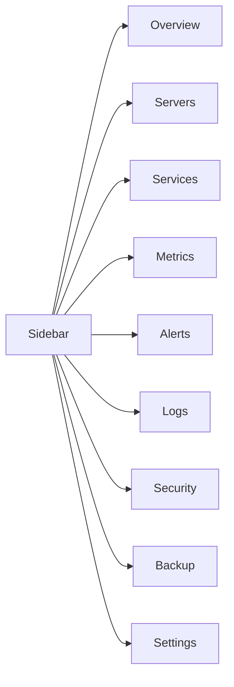
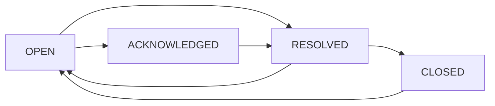

# Feature Spec

## [MODIFY] Mini NOC information architecture

Refactor UI theo hướng Mini Network Operations Center:

- Overview: chỉ hiển thị health summary, active incidents và trạng thái quan trọng nhất.
- Servers: inventory và identity của host đang giám sát.
- Metrics: biểu đồ và tài nguyên hệ thống.
- Services: trạng thái IIS/SQL/FTP và service Windows.
- Alerts: event/cảnh báo thô từ rule engine.
- Incidents: vòng đời xử lý sự cố, playbook, acknowledge/resolve.
- Logs: audit/system/security log.
- Security: failed login, firewall, HTTPS posture.
- Lab: khu mô phỏng sự cố phục vụ demo.
- Settings: cấu hình SNTP, Telegram, threshold; không đặt lẫn trong monitoring flow.

Backup không còn là mục sidebar cấp chính trong MVP; chỉ giữ như thông tin phụ trong Settings/Report để tránh làm Overview quá dài.

## [MODIFY] Runtime Windows data source

- Server identity, IP address, OS version, CPU/RAM/disk and service status are collected from the local Windows host at runtime instead of using demo hardcoded values.
- The alert explanation panel is labeled `Incident playbook` because it is a troubleshooting guide, not a generic AI chat surface.

## [NEW] Current implementation status

- Sidebar has the 9 planned sections as anchors in one dashboard: Overview, Servers, Services, Metrics, Alerts, Logs, Security, Backup, Settings.
- Overview has 6 stat cards: CPU, RAM, Disk, Network, Uptime, Services Health.
- Metrics include SVG CPU/RAM trend, disk donut, and uptime map.
- Incident suggestion panel shows root causes, symptoms/checks, immediate actions, and long-term preventions.
- Settings includes SNTP and Telegram forms. SNTP sync is currently simulated for lab safety and does not call `w32tm` yet.

## [NEW] UI/UX direction

Giao diện dashboard theo hướng admin monitoring tối giản, nền tối, ưu tiên đọc nhanh trạng thái vận hành. Có thể tham khảo cách tổ chức thông tin từ Grafana, Netdata, Zabbix và Windows Admin Center, nhưng không copy nguyên mẫu.

Nguyên tắc:

- Layout dạng sidebar cố định bên trái và main panel bên phải.
- Metric quan trọng nằm ở first screen.
- Dùng card cho chỉ số lặp lại, table/list cho service, alert và log.
- Không dùng emoji trong UI chính; dùng Lucide icons theo `docs/UI_ICON_RULES.md`.
- Dark mode là mặc định, màu severity chỉ dùng để nhấn mạnh trạng thái.

## [NEW] Navigation structure

Sidebar định hướng dài hạn gồm 9 mục:



## [MODIFY] Chart realism and monitoring density

Dashboard uu tien mat do thong tin kieu Mini NOC thay vi cac card qua lon.

Chart hien tai can co:

- Grid line ngang de nguoi xem co moc 0/50/100 hoac scale Kbps.
- Axis label toi gian, khong can chart library nang.
- Current/Avg/Peak cho CPU detail.
- CPU/RAM dual trend co legend kem gia tri hien tai.
- Network throughput chart tach RX/TX va hien thi scale dong.
- Metric card co sparkline nho de nhin xu huong nhanh ngay tren first screen.

Monitoring density:

- Overview card thap hon, van giu so chinh va severity color.
- Dai NOC compact duoi overview hien thi IP, hostname, uptime, open alerts, services running va last collected time.
- Service status dung dang bang compact gom service, state va last check.
- Settings khong duoc lan vao phan chart/monitoring chinh.

Tieu chi hoan thanh:

- [ ] First screen nhin duoc health chinh ma khong can scroll qua nhieu.
- [ ] Chart co moc doc duoc, khong chi la duong line trong.
- [ ] Khong them dependency chart neu SVG noi bo du dung.
- [ ] Khong hardcode hostname/IP demo; lay tu collector/runtime.

## [MODIFY] Page refactor workflow

Dashboard duoc chia theo workflow Mini NOC:

- Overview chi giu high-level monitoring: summary cards, CPU detail, RAM trend, network throughput, active critical alerts, availability map, recent logs va service quick health.
- Incidents la trung tam troubleshooting: incident list, severity/status/time/source, detail playbook, related logs, affected metrics va actions acknowledge/resolve/reopen/close.
- Security tap trung vao failed login, firewall posture, HTTPS status, suspicious IPs, audit logs va account lockout state.
- Settings gom cac cau hinh: Telegram alerts, SNTP, threshold config, polling interval, demo mode va alert sensitivity.
- Lab gom cac kich ban mo phong: IIS Down, SQL Down, CPU Overload, Disk Full, Firewall Block, Network Timeout, Restore Normal.

Nguyen tac UI:

- Sticky top bar hien thi realtime status, alert counter, sync/polling state, environment va user profile.
- Severity color: normal zinc, info blue, warning yellow, critical red.
- Overview khong duoc chua Telegram/SNTP/security config hoac demo scenario.

## [MODIFY] Lab simulation engine

Lab mode chay collector cycle mo phong moi 3 giay thong qua overview polling:

- Scenario thay doi metrics.
- Scenario tao alert tu rule engine hoac alert custom.
- Scenario insert log demo.
- Scenario anh huong service status khi can.
- Incident playbook lay tu rule-based suggestion theo alert type.

Alert lifecycle MVP:



Vai trò từng trang:

- Overview: tổng quan sức khỏe server, metrics và sự cố mở.
- Servers: danh sách server trong lab, IP, OS, trạng thái online/offline.
- Services: trạng thái IIS, SQL Server, FTP và service Windows quan trọng.
- Metrics: biểu đồ lịch sử CPU/RAM/Disk/Network theo 1 giờ hoặc 24 giờ.
- Alerts: danh sách sự cố, acknowledge và resolve.
- Logs: log ứng dụng, auth log, Windows Event Log rút gọn.
- Security: failed login, firewall, HTTPS/SSL, port quan trọng.
- Backup: trạng thái backup database/code/config.
- Settings: threshold, SNTP/NTP và Telegram alert channel.

## [NEW] Advanced overview cards

Overview dài hạn nên có 6 stat cards:

- CPU.
- RAM.
- Disk.
- Network.
- Uptime.
- Services Health.

Dynamic state colors:

- Normal: dưới 75%, màu trung tính hoặc teal nhẹ.
- Warning: từ 75-90% hoặc theo threshold riêng, màu amber.
- Critical: trên 90-95% hoặc service chính down, màu red.

Services Health tính theo tỷ lệ service đang chạy. Nếu IIS hoặc SQL Server stopped, card này phải chuyển trạng thái critical dù các service phụ vẫn running.

## [NEW] Realtime SVG chart spec

Biểu đồ có thể vẽ bằng SVG để nhẹ, dễ kiểm soát và không phụ thuộc chart library lớn.

Biểu đồ đề xuất:

- CPU/RAM dual trend: 60 mẫu gần nhất, CPU là line, RAM là area.
- Disk radial donut: thể hiện usage của ổ chính hoặc nhiều phân vùng.
- Network throughput area: Rx/Tx tách màu rõ.
- Uptime grid map: 24 chu kỳ gần nhất, xanh là online, xám là stale heartbeat, đỏ là offline hoặc service lõi down.

Nguyên tắc:

- Không lạm dụng animation; chỉ dùng pulse nhẹ cho trạng thái critical.
- Chart phải responsive và không làm thay đổi layout khi dữ liệu cập nhật.
- Polling 3-15 giây phù hợp demo; không cần realtime tuyệt đối.

## [NEW] Incident detail playbook

Khi mở một alert, dashboard nên hiển thị Incident Detail Panel gồm 4 phần:

- Root causes: nguyên nhân có thể.
- Symptoms: dấu hiệu nhận biết.
- Immediate actions: bước xử lý ngay.
- Long-term preventions: biện pháp phòng tránh.

Ví dụ với IIS down:

- Root causes: W3SVC stopped, Application Pool crash, port 80/443 bị chiếm, cấu hình web lỗi.
- Symptoms: HTTP 503, website unreachable, Event Viewer có service stopped event.
- Immediate actions: kiểm tra W3SVC, start service, kiểm tra App Pool, kiểm tra binding và port.
- Long-term preventions: cấu hình recovery cho service, bật alert sớm, backup cấu hình IIS.

## [NEW] SNTP and Telegram settings

Settings page dài hạn cần hỗ trợ:

- Cấu hình SNTP/NTP server mặc định, ví dụ `pool.ntp.org`.
- Xem trạng thái đồng bộ giờ gần nhất.
- Kích hoạt đồng bộ giờ thủ công bằng quyền admin.
- Cấu hình Telegram Bot Token và Chat ID.
- Gửi test message để kiểm tra kênh cảnh báo.

Nguyên tắc:

- Chỉ admin được chỉnh settings.
- Bot token không hiển thị lại đầy đủ trên UI.
- Telegram chỉ là kênh cảnh báo phụ, dashboard vẫn là nguồn chính.

## Dashboard CPU/RAM/Disk/Network

Mục tiêu: hiển thị nhanh tình trạng server.

Icon UI phải tuân theo [UI_ICON_RULES.md](./UI_ICON_RULES.md). Package mặc định là `lucide-react`; chỉ dùng Tabler hoặc React Icons khi Lucide không đủ icon phù hợp.

Thông tin hiển thị:

- Hostname.
- IP address.
- Uptime.
- CPU usage hiện tại.
- RAM usage hiện tại.
- Disk usage theo ổ đĩa.
- Network status hoặc throughput.
- Thời điểm cập nhật cuối.

Checklist:

- [ ] Card CPU có màu warning/critical theo ngưỡng.
- [ ] Card RAM có màu warning/critical theo ngưỡng.
- [ ] Card disk hiển thị từng ổ đĩa.
- [ ] Network hiển thị online/offline hoặc tốc độ cơ bản.
- [ ] Có biểu đồ lịch sử ngắn hạn.

## Service status IIS/SQL Server

Mục tiêu: theo dõi dịch vụ quan trọng trên Windows Server.

Dịch vụ tối thiểu:

- IIS hoặc W3SVC.
- SQL Server hoặc MSSQLSERVER/SQLEXPRESS.

Thông tin hiển thị:

- Tên service.
- Display name.
- Trạng thái: running, stopped, paused, unknown.
- Startup type nếu lấy được.
- Last checked time.

Checklist:

- [ ] Service running hiển thị xanh.
- [ ] Service stopped hiển thị đỏ.
- [ ] Khi service stopped, tạo alert nếu chưa có alert mở.

## Alert rule

Rule mặc định:

| Loại | Điều kiện | Mức độ |
|---|---|---|
| CPU high | CPU > 90% trong 2 lần kiểm tra liên tiếp | critical |
| RAM high | RAM > 85% | warning |
| Disk full | Disk > 95% | critical |
| IIS down | W3SVC stopped | critical |
| SQL down | SQL Server stopped | critical |
| Login brute force | 5 failed login trong 10 phút | warning |
| Network unreachable | Ping timeout hoặc collector không gửi dữ liệu | critical |

Checklist:

- [ ] Rule có thể cấu hình ngưỡng.
- [ ] Alert có trạng thái open/acknowledged/resolved.
- [ ] Alert có title, severity, source, message và timestamp.

## Notification

Phiên bản đầu:

- Hiển thị badge số alert đang mở.
- Hiển thị toast hoặc banner khi có alert mới.
- Trang alerts có bộ lọc severity/status.

Không bắt buộc trong đồ án:

- Email notification.
- SMS notification.
- Push notification.

Checklist:

- [ ] Có chỉ báo alert mới trên dashboard.
- [ ] Có danh sách alert.
- [ ] Có trang chi tiết alert.

## Log viewer

Mục tiêu: hỗ trợ troubleshooting.

Loại log:

- Authentication log của dashboard.
- Alert log.
- Service status change.
- Windows Event Log rút gọn.
- Security event như failed login.

Checklist:

- [ ] Lọc theo thời gian.
- [ ] Lọc theo severity.
- [ ] Lọc theo source.
- [ ] Không hiển thị dữ liệu nhạy cảm như password/token.

## User role Admin/Viewer

### Admin

Quyền:

- Xem dashboard.
- Xem alerts/logs.
- Acknowledge/resolve alert.
- Cấu hình thresholds.
- Quản lý users.

### Viewer

Quyền:

- Xem dashboard.
- Xem alerts/logs cơ bản.
- Không chỉnh cấu hình.
- Không quản lý users.

Checklist:

- [ ] Middleware kiểm tra role.
- [ ] UI ẩn thao tác không phù hợp role.
- [ ] Backend vẫn bắt buộc kiểm tra quyền, không chỉ ẩn nút ở frontend.

## AI suggestion panel

Mục tiêu: hỗ trợ giải thích alert và đề xuất cách xử lý.

Nội dung panel:

- Tóm tắt sự cố.
- Nguyên nhân có thể.
- Bước kiểm tra.
- Cách xử lý đề xuất.
- Cách phòng tránh.

Nguyên tắc:

- Không tự động chạy lệnh trên server.
- Không thay thế quyết định của admin.
- Không biến dashboard thành web chat tổng quát.
- Có thể bắt đầu bằng rule-based suggestion trước khi tích hợp AI API.

Ví dụ:

```text
Alert: IIS service stopped

Nguyên nhân có thể:
- Service bị stop thủ công.
- Application pool crash.
- Cấu hình website lỗi.
- Port 80/443 bị chiếm hoặc bị firewall chặn.

Đề xuất xử lý:
- Kiểm tra W3SVC trong Services.
- Kiểm tra Event Viewer.
- Restart IIS.
- Kiểm tra binding và port 80/443.
```
